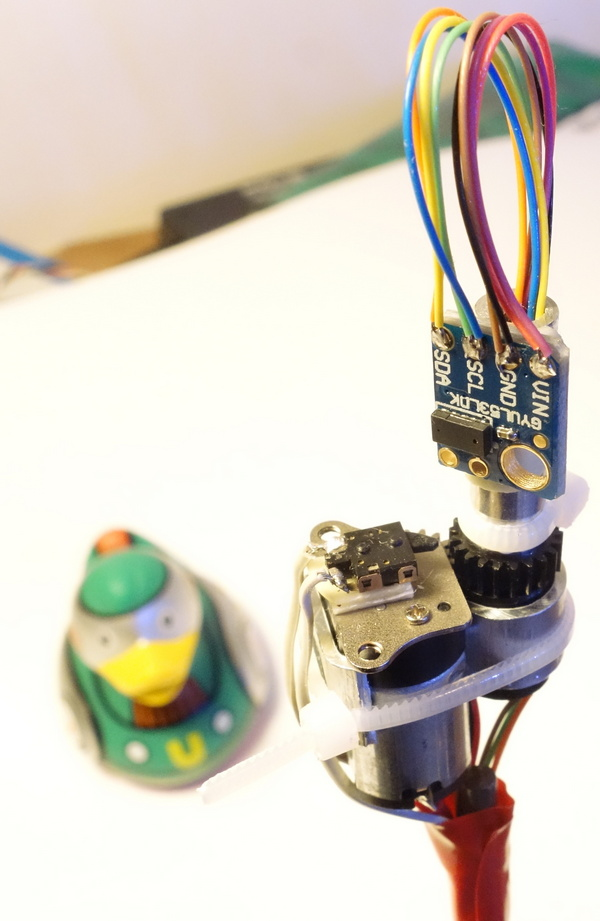
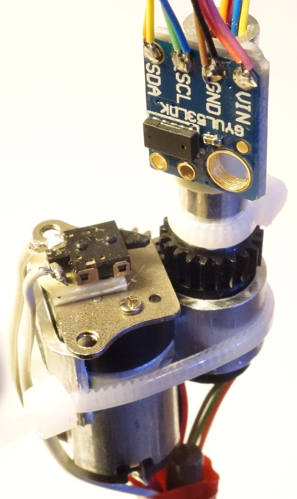
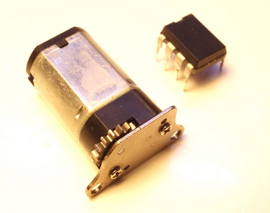
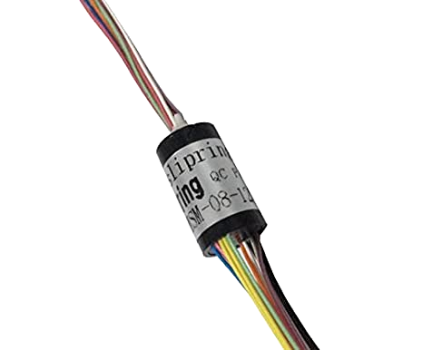
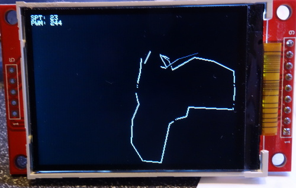

# 360 degree lidar based on vl53l0x.

  

Realtime lidar with TFT screen and autospeed compatibility.
Up to 1.2m scan range.
vl53l0x can do fast scanning, but when it comes to rotation the speed is never enough.
It can do up to about 50 readings per 1 second. In other hand 1 second is too long for a turn.

So this motor turns about 2 turns per second so we can get ~24 readings per 360 degree.

Slipring with 8 contacts doubles every wire. I haven't tried 4-wire slipring but this one works perfect.

Update TFT library for your connections (DC, RESET...). Drawing takes much cpu time.

PWM motor control - D3, Turn sensor - D2. SPI to TFT, I2C to lidar.

This project is just for fun.
Airrr 02.04.23